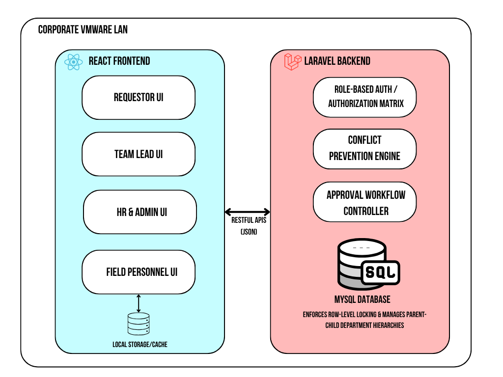
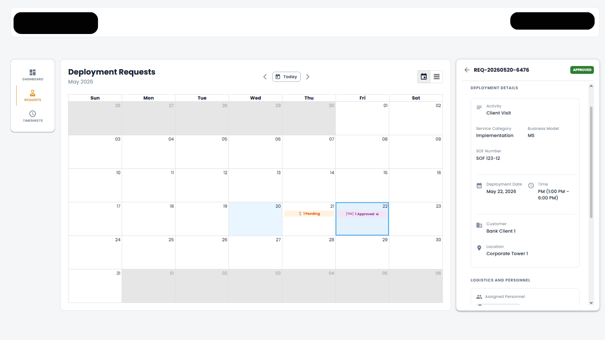
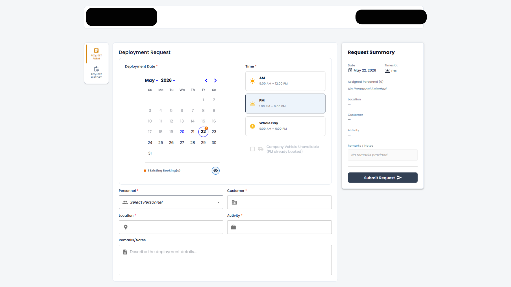
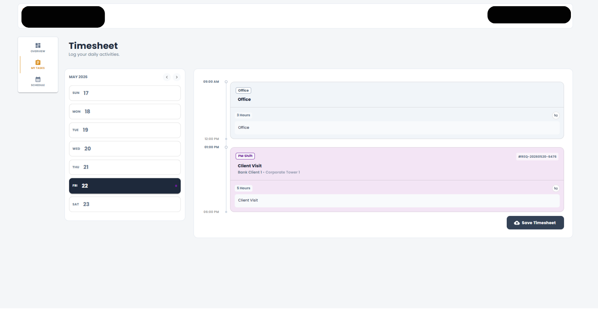

# field-service-management-showcase
A full-stack, role-based Field Service Management architecture showcase featuring real-time conflict prevention, dynamic UI rendering, and complex resource allocation workflows.

# Enterprise Field Service Management System (Architecture Showcase)

> **Disclaimer:** This repository serves as a technical case study and architectural showcase. Due to strict NDAs and client confidentiality, **no proprietary source code, database credentials, or sensitive client data are included.**

## Project Overview
A comprehensive, full-stack enterprise platform engineered to orchestrate onsite projects, hardware deliveries, and technical support. The system serves as a centralized command center, bridging operations across Sales, Finance, ITSM, HR, and Field Engineers through strict role-based access controls and real-time conflict prevention.

## Tech Stack & Infrastructure
* **Frontend:** React, Material-UI (MUI), JavaScript
* **Backend:** Laravel, PHP, RESTful APIs
* **Database:** MySQL (Advanced row-level locking)
* **Infrastructure:** Corporate VMware LAN

## System Architecture by Module

### 1. Requestor Module (Sales, Finance, ITSM, Marketing)
The primary entry point for customer-facing departments to orchestrate resources.
* **Dynamic Smart Forms:** Adapts the UI and required fields in real-time based on the user's department and request type (e.g., dynamically toggling "SOF Number" vs. "Project Name").
* **Real-Time Conflict Prevention:** Actively polls the database during input, instantly disabling booked timeslots, vehicles, and personnel to prevent double-booking prior to submission.
* **Lifecycle Management:** A dedicated dashboard for users to track, edit, cancel, or reschedule tickets, with automated alerting for changes requiring re-approval.

### 2. Team Lead Module (Command Center)
A centralized hub for department heads to allocate resources and oversee daily operations.
* **Interactive Deployment Dashboards:** Features rich data visualizations, including a monthly Heatmap, Request Calendar, and priority-based slide-out drawers.
* **Advanced Approval Workflow:** Manages granular approvals (e.g., separate Personnel and Vehicle sign-offs) and handles complex "Partially Approved" database states.
* **"God Mode" & Direct Assignment:** Allows managers to inspect subordinate timesheets and forcefully deploy engineers by overriding standard request flows for emergencies.

### 3. Field Personnel Module
A specialized portal for technicians to log activities and view assignments.
* **Dynamic Timesheet Timeline:** Replaces static forms with a visual daily timeline, auto-populated with approved deployments, client context, and task metadata.
* **Smart Time-Blocking Engine:** Enables technicians to dynamically merge or split contiguous 1-hour work blocks for granular reporting.
* **Resilient Draft System:** Utilizes a silent, local-storage auto-save mechanism to instantly cache keystrokes and prevent data loss during network interruptions or accidental navigation.

### 4. HR & Admin Module
The administrative backbone for personnel management and high-level tracking.
* **Resource CRUD:** Manages employee records, roles, and complex department assignments.
* **Global View-Only Tracking:** Allows secure oversight of the deployment calendar across all departments without risk of accidental modification.
* **Logistics Monitoring:** Tracks company vehicle utilization with dynamic constraint warnings (e.g., mapping to local traffic and number coding rules).

##  Architecture & Data Flow

## 🖥️ System Interfaces

**Team Lead Command Center: Approval Calendar**

> Centralized dashboard for department heads to manage granular approvals and resolve scheduling conflicts.

**Dynamic Smart Request Form**

> Adaptive UI that toggles required fields and actively polls the database to prevent double-booking before submission.

**Field Personnel Timesheet Timeline**

> Visual daily timeline featuring the smart time-blocking engine and resilient local-storage auto-save system.

***

## 🚀 Key Takeaways & Business Impact
Building this system required balancing strict enterprise logistical rules with a highly fluid user experience. Navigating row-level database locking and real-time React state management was a massive technical hurdle, but it resulted in a stable, zero-debt deployment that successfully eliminated scheduling bottlenecks for the organization.

## 📬 Let's Connect
Are you a recruiter or engineering manager looking for a full-stack developer who understands both clean frontend architecture and complex backend business logic? I would love to chat!

* **LinkedIn:** [Connect with me here](https://linkedin.com/in/rainier-merencillo)
* **Email:** [rainier.merencillo@gmail.com]
* **GitHub Profile:** [Mereen21](https://github.com/Mereen21)
